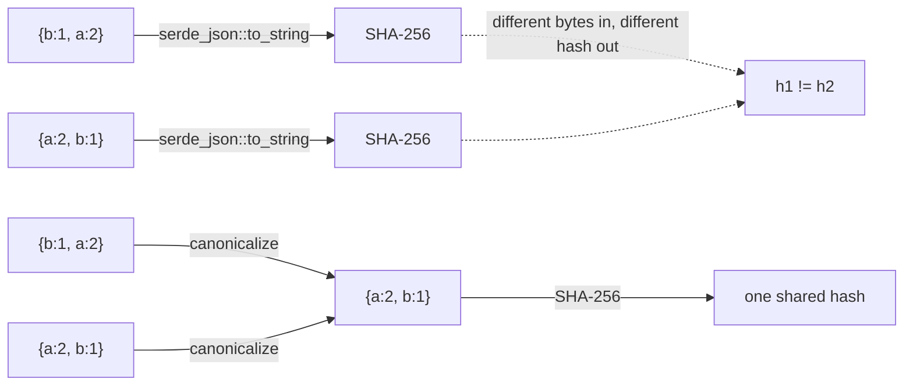
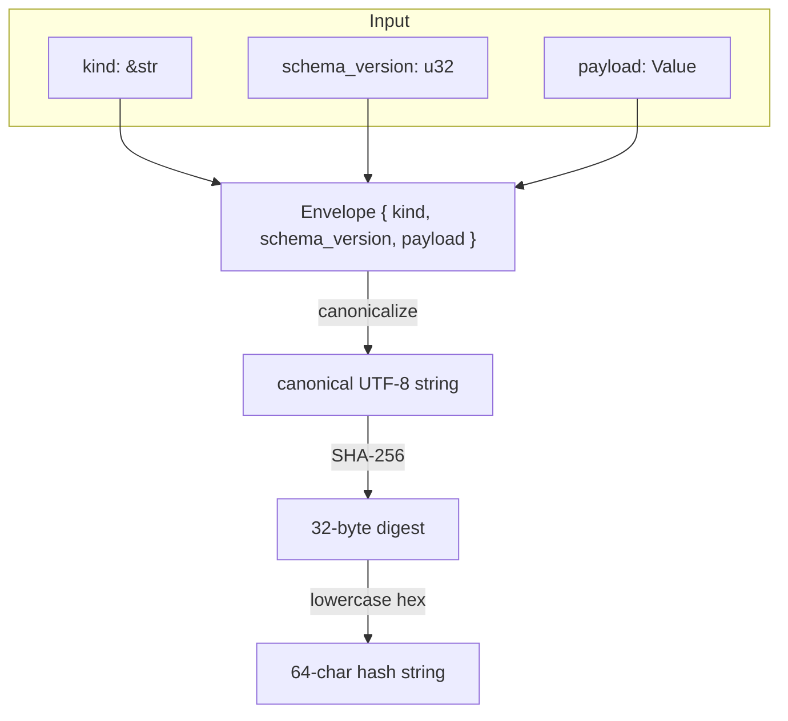

# rfc8785-jcs

[RFC 8785](https://www.rfc-editor.org/rfc/rfc8785) JSON Canonicalization
Scheme (JCS) for `serde_json::Value`, plus a small named/versioned SHA-256
hash built on top of it. No async, no I/O, no dependencies beyond
`serde`/`serde_json`/`sha2`/`thiserror`.

## Why canonicalize before hashing

`serde_json` (and JSON generally) doesn't guarantee object key order is
preserved or comparable. Two values that are semantically identical can
serialize to different byte strings depending on which order their keys
happened to be inserted in — which means hashing the raw serialized bytes
gives you a hash that isn't actually a function of the *value*, just of one
particular serialization of it.



`canonicalize()` fixes this: it always produces the same UTF-8 string for
structurally-equal values, regardless of how they were built or in what
order their keys were inserted.

## The `named_hash` envelope

Hashing a bare payload means a schema change or a payload that's coincidentally
identical between two different "kinds" of thing can silently collide.
`named_hash` wraps the payload in `{kind, schema_version, payload}` before
canonicalizing, so both are part of what's actually being hashed:



Two payloads with identical content but a different `kind`, or the same
`kind` on a different `schema_version`, are guaranteed to hash differently
— see `hash_changes_when_kind_or_schema_version_changes` in the tests.

## What's deliberately not handled

- **Floating point is rejected, not canonicalized.** RFC 8785 defines a
  canonical form for IEEE-754 doubles, but in practice it's a frequent
  source of cross-language hash mismatches (denormals, `-0.0` vs `0.0`,
  and NaN/Infinity have no valid JSON form to begin with). If a value
  needs an exact, cross-platform-stable hash, encode it as an integer or a
  string before handing it to this crate.
- **Key ordering assumes ASCII keys.** Object keys sort using Rust's
  default `String` `Ord` (byte-wise UTF-8 comparison), which matches
  RFC 8785's UTF-16-code-unit ordering for ASCII keys, but could diverge
  for non-ASCII ones.

## Usage

```rust
use serde_json::json;

let a = json!({"b": 1, "a": 2});
let b = json!({"a": 2, "b": 1});
assert_eq!(rfc8785_jcs::canonicalize(&a)?, rfc8785_jcs::canonicalize(&b)?);

let hash = rfc8785_jcs::named_hash("example", 1, json!({"hello": "world"}))?;
assert_eq!(hash.len(), 64);
# Ok::<(), rfc8785_jcs::JcsError>(())
```

## License

MIT
